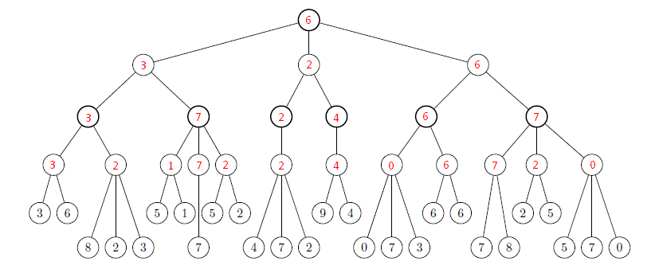
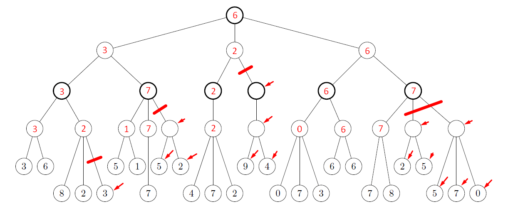
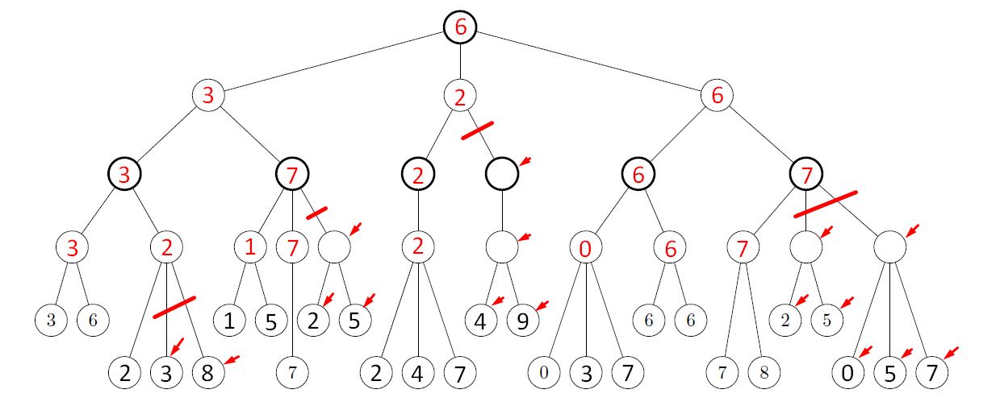

# Τεχνητή Νοημοσύνη, 8ο εξάμηνο, ΣΗΜΜΥ ΕΜΠ, 11/2017
## Γαβαλάς Νίκος, ΑΜ 03113121
## 1η Σειρά Γραπτών Ασκήσεων

***

### Άσκηση 1
### 1. 

#### Beam Search 
| Βήμα  | Μέτωπο Αναζήτησης                                                                                     | Τρέχουσα Κατάσταση | Παιδιά της Τρέχουσας (+ τιμές ευριστικών) |
| :---: | :---------------------------------------------------------------------------------------------------: | :----------------: | :---------------------------------------: |
| 1     | [(s,9)--]                                                                                  | --                 | --                                        |
| 2     | [(d,3)s,(c,4)s]                                                                 | s                  | [(d,3),(c,4),(b,5)]                       |
| 3     | [(c,4)s,(i,2)sd,(h,5)sd]                                             | d                  | [(i,2),(h,5)]                             |
| 4     | [(i,2)sd,(h,5)sd,(h,5)sc]                                            | c                  | [(h,5)]                                   |
| 5     | [(h,5)sd,(h,5)sc,(j,3)sdi]                                           | i                  | [(j,3)]                                   |
| 6     | [(h,5)sc,(j,3)sdi,(i,2)sdh,(j,3)sdh]                      | h                  | [(i,2),(j,3)]                             |
| 7     | [(j,3)sdi,(i,2)sdh,(j,3)sdh,(i,2)sch,(j,3)sch] | h                  | [(i,2),(j,3)]                             |
| 8     | [(i,2)sdh,(j,3)sdh,(i,2)sch,(j,3)sch]                     | j                  | []                                        |
| 9     | [(j,3)sdh,(i,2)sch,(j,3)sch,(j,3)sdhi]                    | i                  | [(j,3)]                                   |
| 10    | [(i,2)sch,(j,3)sch,(j,3)sdhi]                                        | j                  | []                                        |
| 11    | [(j,3)sch,(j,3)sdhi,(j,3)schi]                                       | i                  | [(j,3)]                                   |
| 12    | [(j,3)sdhi,(j,3)schi]                                                           | j                  | []                                        |
| 13    | [(j,3)schi]                                                                                | j                  | []                                        |
| 14    | []                                                                                                    | j                  | []                                        |

#### Best First
| Βήμα  | Μέτωπο Αναζήτησης                                                            | Κλειστό σύνολο | Τρέχουσα Κατάσταση | Παιδιά της Τρέχουσας (+ τιμές ευριστικών) |
| :---: | :--------------------------------------------------------------------------: | :------------: | :----------------: | :---------------------------------------: |
| 1     | [(s,9)--]                                                         | []             | --                 | []                                        |
| 2     | [(d,3)s,(c,4)s,(b,5)s]                      | [s]            | s                  | [(d,3),(c,4),(b,5)]                       |
| 3     | [(i,2)sd,(c,4)s,(b,5)s,(h,5)sd]  | [sd]           | d                  | [(i,2),(h,5)]                             |
| 4     | [(j,3)sdi,(c,4)s,(b,5)s,(h,5)sd] | [sdi]          | i                  | [(j,3)]                                   |
| 5     | [(c,4)s,(b,5)s,(h,5)sd]                     | [sdij]         | j                  | []                                        |
| 6     | [(b,5)s,(h,5)sd]                                       | [sdijc]        | c                  | [(h,5)]                                   |
| 7     | [(k,2)sb,(h,5)sd,(e,5)sb]                   | [sdijcb]       | b                  | [(k,2),(e,5)]                             |
| 8     | [(g,0)sbk,(h,5)sd,(e,5)sb]                  | [sdijcbk]      | k                  | [(g,0),(h,5)]                             |
| 9     | [(h,5)sd,(e,5)sb]                                      | [sdijcbkg]     | **g**              | []                                        |

#### A*
| Βήμα  | Μέτωπο Αναζήτησης                                                                                                    | Κλειστό σύνολο | Τρέχουσα Κατάσταση | Παιδιά της Τρέχουσας (+ τιμές ευριστικών) |
| :---: | :------------------------------------------------------------------------------------------------------------------: | :------------: | :----------------: | :---------------------------------------: |
| 1     | [(s,0,9)--]                                                                                                          | []             | --                 | []                                        |
| 2     | [(d,1,4)s,(c,2,6)s,(b,2,7)s]                                                        | [s]            | s                  | [(d,3),(c,4),(b,5)]                       |
| 3     | [(c,2,6)s,(b,2,7)s,(h,3,8)sd,(i,15,17)sd]                                | [sd]           | d                  | [(i,2),(h,5)]                             |
| 4     | [(b,2,7)s,(h,3,8)sd,(i,15,17)sd]                                                    | [sdc]          | c                  | [(h,5)]                                   |
| 5     | [(k,3,5)sb,(h,3,8)sd,(e,5,10)sb,(i,15,17)sd]                             | [sdcb]         | b                  | [(k,2),(e,5)]                             |
| 6     | [(h,3,8)sd,(e,5,10)sb,(g,11,11)sbk,(i,15,17)sd]                          | [sdcbk]        | k                  | [(g,0),(h,5)]                             |
| 7     | [(i,6,8)sdh,(e,5,10)sb,(g,11,11)sbk,(j,10,13)sdh,(i,15,17)sd] | [sdcbkh]       | h                  | [(i,2),(j,3)]                             |
| 8     | [(e,5,10)sb,(g,11,11)sbk,(j,10,13)sdh,(j,10,13)sdhi]                     | [sdcbkhi]      | i                  | [(j,3)]                                   |
| 9     | [(g,10,10)sbe,(j,10,13)sdh,(j,10,13)sdhi]                                           | [sdcbkhie]     | e                  | [(g,0)]                                   |
| 10    | [(j,10,13)sdh,(j,10,13)sdhi]                                                                   | [sdcbkhieg]    | **g**              | []                                        |

### 2. 
To πρόβλημα έχει δύο (2) λύσεις (όλα τα πιθανά μονοπάτια μέχρι την τελική κατάσταση g), και βέλτιστη λύση είναι μία (το συντομότερο μονοπάτι, εν προκειμένω η διαδρομή s->b->e->g). Δεν βρίσκουν όλοι οι αλγόριθμοι λύση, πόσο μάλλον τη βέλτιστη.

Συγκεκριμένα:

- Ο Beam Search δεν βρίσκει λύση
- Ο Best first βρίσκει λύση αλλά δεν είναι η βέλτιστη (s->b->k->g)
- O A* βρίσκει λύση και είναι η βέλτιστη

***

### Άσκηση 2

### 1.

### 2. 

Με βελάκι είναι σημειωμένοι οι κόμβοι που δεν επισκεπτόμαστε.

### 3. 

Ομοίως, με βελάκι είναι σημειωμένοι οι κόμβοι που δεν επισκεπτόμαστε.

